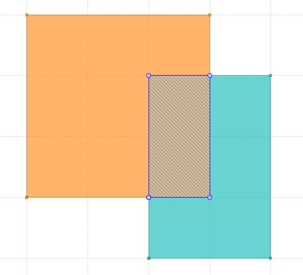
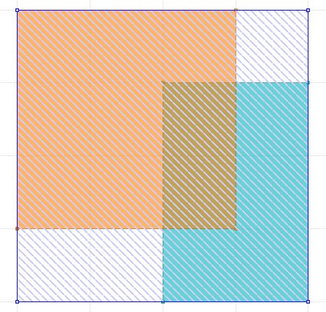
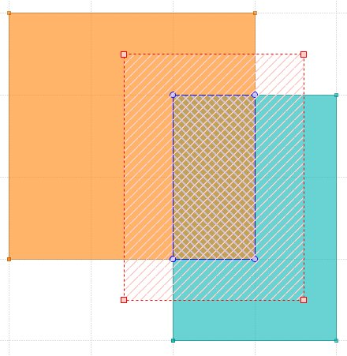

# bbox-2d
Minimum bounding rectangle (**MBR**)- axis aligned rectangle in 2d space.

## Coverage
```bash
[INFO tarpaulin] Coverage Results:
|| Uncovered Lines:
|| Tested/Total Lines:
|| src/lib.rs: 176/176
|| src/mbr_tests.rs: 275/275
|| 
100.00% coverage, 451/451 lines covered
```

## Examples 
```rust
use bbox_2d::MBR;
use point::Point;

fn main() {
    let pt = Point{x:  367.74747560229144, y: 363.2231833134207};
    let a = MBR::new_from_bounds(Point { x: 350., y: 400. }, Point { x: 200., y: 250. });
    let b = MBR::new(300., 200., 400., 350.);
    println!("a intersects b = {} ", a.intersects(&b));
    println!("a disjoint b = {} ", a.disjoint(&b));
    println!("a equals b = {} ", a == b );

    let inter = a.intersection(&b).unwrap();
    println!("{}", inter);//POLYGON ((300 250,300 350,350 350,350 250,300 250))
    //intersection (same as inter above)
    let mut  inter_a_b = (&a & &b).unwrap();
    println!("area A={}, area B={}; A&B {}", a.area(), b.area(), inter_a_b.area());
    //area A=22500, area B=15000; A&B 5000
    println!("inter_a_b intersects pt = {}", inter_a_b.intersects_point(&pt));

    //union
    let union_a_b = &a | &b;
    println!("area A={}, area B={}; A|B {}", a.area(), b.area(), union_a_b.area());
    //area A=22500, area B=15000; A+B 40000
    println!("a | b = {}", union_a_b);

    //some methods :
    println!("is a&b decompose as point = {}", inter_a_b.is_point());
    println!("width  of a&b = {}", inter_a_b.width());
    println!("height of a&b = {}", inter_a_b.height());
    inter_a_b.expand_by_delta(30.0, 25.0);
    println!("{}", inter_a_b);//POLYGON ((270 225,270 375,380 375,380 225,270 225))

    //contains
    println!("inter_a_b intersects pt = {}", inter_a_b.intersects_point(&pt));
    println!("inter_a_b intersects pt = {}", inter_a_b.intersects_xy(pt.x , pt.y));
    println!("inter_a_b intersects pt = {}", inter_a_b.contains(&MBR::new_from_pt(pt)));
    println!("inter_a_b intersects pt = {}", inter_a_b.contains_xy(pt.x, pt.y));

    //distance
    println!("a distance to mbr(pt) = {}", a.distance(&MBR::new_from_pt(pt)));

}
```

*Intersection = `A & B`*



*Union =`A | B`*



*Intersection exapand by `dx=30,dy=25`*




## API
### Fields
```rust
struct MBR {
    pub ll: Point,
    pub ur: Point
}
```

### Constructors 
New MBR given ll & ur
```rust
fn new(ll: Point, ur: Point) -> MBR
```

New MBR as given ll & ur  
```rust
fn new_raw(ll: Point, ur: Point) -> MBR
```

New MBR from zero value
```rust
fn new_default() -> MBR
```

New MBR from point
```rust
fn new_from_pt(a: Point) -> MBR
```

New MBR from array of 4 coordinates [x1, y1, x2, y2]
```rust
fn new_from_array(o: [f64; 4]) -> MBR
```

### Methods
**bbox** is reference to `self`
```rust
fn bbox(&self) -> &Self
```

**copy** copy of `self`
```rust
fn copy(&self) -> Self
```

**width** of bounding box.
```rust
fn width(&self) -> f64
```

**height** of bounding box.
```rust
fn height(&self) -> f64
```

**area** of bounding box.
```rust
fn area(&self) -> f64
```

as a **closed** polygon coordinates
```rust
fn as_poly_array(&self) -> Vec<Point>
```

as an array 
```rust
fn as_array(&self) -> [f64; 4]
```

bounds as **tuple** [minx,miny, maxx,maxy]
```rust
fn as_tuple(&self) -> (f64, f64, f64, f64)
```

Lower left and upper right: Point(minx,miny)-Point(maxx,maxy)
```rust
fn llur(self) -> [Point; 2]
```

**equality** of two bounding boxes
```rust
fn equals(&self, other: &Self) -> bool
```

is it a **point**, width and height as 0.
```rust
fn is_point(&self) -> bool
```

check for **containment** of `other`
```rust
fn contains(&self, other: &Self) -> bool
```

**contains** `x`, `y`
```rust
fn contains_xy(&self, x: f64, y: f64) -> bool
```

**completely contains** other 
```rust
fn completely_contains(&self, other: &Self) -> bool
```

**completely contains** `x`, `y` 
```rust
fn completely_contains_xy(&self, x: f64, y: f64) -> bool
```

**translate** by `dx`, `dy`
```rust
fn translate(&self, dx: f64, dy: f64) -> MBR
```

**centre** of bounding box
```rust
fn centre(&self) -> Point
```

**intersects** other box
```rust
fn intersects(&self, other: &Self) -> bool
```

**intersects** point
```rust
fn intersects_point(&self, pt: &Point) -> bool
```

**intersects** `x, y`
```rust
fn intersects_xy(&self, x: f64, y: f64) -> bool
```

**intersects** bounds
```rust
fn intersects_bounds(&self, pt1: &Point, pt2: &Point) -> bool
```

checks **disjoint** between boxes
```rust
fn disjoint(&self, m: &Self) -> bool
```

**intersection** between boxes
```rust
fn intersection(&self, other: &Self) -> Option<MBR>
```

**expand** to include other box
```rust
fn expand_to_include(&mut self, other: &Self) -> &mut MBR
```

**expand** to include `x, y`
```rust
fn expand_to_include_xy(&mut self, x: f64, y: f64) -> &mut Self
```

**expand** by deltas : dx, dy (pad x and y dimension by dx and dy)
```rust
fn expand_by_delta(&mut self, dx: f64, dy: f64) -> &mut MBR
```

**dx, dy** between two bounding boxes
```rust
fn distance_dxdy(&self, other: &Self) -> (f64, f64)
```

**distance** between boxes
```rust
fn distance(&self, other: &Self) -> f64
```

**square** distance between boxes
```rust
fn distance_square(&self, other: &Self) -> f64
```

**wkt** string 
```rust
fn wkt(&self) -> String
```

## LIC 
 MIT